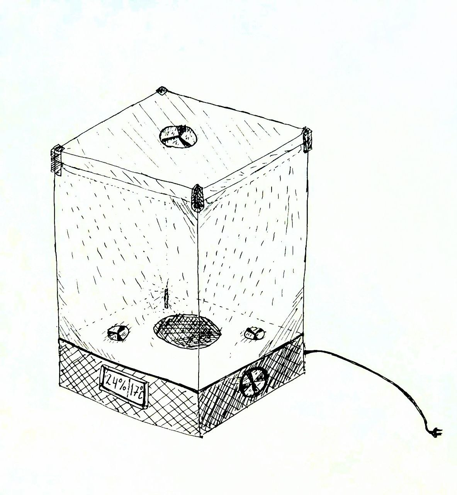

# Портативный тепличный комплекс с полным контролем микроклимата

## Проектное предложение

---

## Ментор
Проворотов Павел Владимирович

---

## Команда
- Загороднюк Михаил, Б01-503 — [@mister_mikl](https://t.me/mister_mikl)
- Чепайкин Семен, Б01-503 — [@Chipulikk](https://t.me/Chipulikk)
- Скворцов Николай, Б01-503 — [@n1sk_0v](https://t.me/n1sk_0v)

---

## Цель проекта
Создать портативный тепличный комплекс с замкнутым контуром управления микроклиматом для автоматического поддержания заданных агротехнических параметров (температуры воздуха, относительной влажности, освещённости и влажности почвы) с возможностью настройки через веб-интерфейс, минимальным участием пользователя и временем автономной работы не менее 72 часов.

---

## Описание функционала
Разрабатываемое устройство представляет собой автономную тепличную установку, обеспечивающую контроль и регулирование микроклимата в заданных диапазонах.

---

## Целевые параметры

| Параметр | Диапазон / Значение |
|----------|--------------------|
| Влажность воздуха | 30–40% (комнатная) → 75% |
| Температура воздуха | +20 … +30 °C |
| Освещённость | регулируемая |
| Влажность почвы | автоматическое поддержание |
| Время работы | ≥ 72 часа |
| Габариты | 800 × 800 × 1000 мм |
| Конструкция | полугерметичное основание + герметичный корпус |
| Материалы | фанера/пластик, акрил/поликарбонат |

---

## Реализуемые функции

### Контроль
- измерение температуры и влажности воздуха
- измерение освещённости
- измерение влажности почвы (ёмкостной датчик)
- контроль уровня воды

### Регулирование
- управление увлажнением воздуха
- управление вентиляцией (приток/вытяжка)
- управление нагревом
- управление освещением (LED)
- автоматический полив

### Автоматизация
- работа по заданным уставкам
- настройка через веб-интерфейс
- замкнутый контур управления (feedback)

---

## Задачи проекта
1. Анализ и выбор элементной базы
2. Разработка алгоритмов управления
3. Проектирование электрической схемы
4. Разработка CAD-модели
5. Проведение CAE-расчётов
6. Изготовление прототипа
7. Сборка системы
8. Испытания и калибровка

---

## Анализ существующих аналогов

### 1. Aerogarden (коммерческое решение)
**Описание:**
Компактная гидропонная система для дома.

**Плюсы:**
- простота
- компактность
- дизайн

**Минусы:**
- нет контроля микроклимата
- малый объём
- высокая цена

🔗 https://www.aerogarden.com/

---

### 2. OpenHydroponics (Open Source)
**Описание:**
Система на Arduino для управления гидропоникой.

**Плюсы:**
- гибкость
- низкая стоимость
- масштабируемость

**Минусы:**
- сложность сборки
- нет корпуса

🔗 https://github.com/OpenHydroPonics/OpenHydroPonics

---

### 3. DIY-проекты на Arduino
**Описание:**
Любительские проекты с использованием ESP32/Arduino.

**Плюсы:**
- доступность
- большое сообщество

**Минусы:**
- слабая герметизация
- отсутствие веб-интерфейса
- низкая автономность

🔗 https://www.instructables.com/Arduino-Controlled-Greenhouse/

---

## Отличия проекта
- полный контроль микроклимата
- автономная работа ≥ 72 часов
- веб-интерфейс управления
- модульная конструкция

---

## Эскиз проекта

---

## Элементная база

### Контроллер
- **ESP32** (основной вариант)
- Arduino (альтернатива)

---

### Сенсоры
- температура/влажность: **DHT22 / SHT31**
- освещённость: **BH1750**
- влажность почвы: ёмкостной датчик
- уровень воды: оптический / поплавковый

---

### Исполнительные устройства
- вентиляторы (12V, 80–120 мм)
- насос (перистальтический / погружной)
- увлажнитель (ультразвуковой)
- LED освещение (full spectrum)
- нагреватель

---

### Дополнительно
- воздушный фильтр
- резервуар (5–10 л)
- воздуховоды
- корпус (акрил / пластик)
- блок питания (12V / 5V)
- аккумулятор (12V, 7 А·ч)

---

## Итог
Проект представляет собой автономную систему контроля микроклимата с возможностью гибкой настройки и минимальным участием пользователя.
